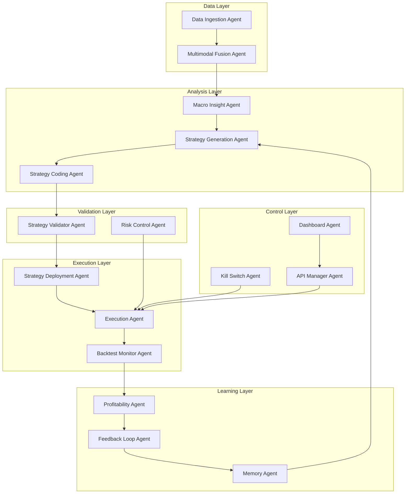

# QuantAI AutoGen Architecture

## Overview

The QuantAI AutoGen system is a sophisticated multi-agent AI framework designed for automated quantitative trading strategy development, validation, and execution. Built on Microsoft AutoGen, it leverages the latest advances in large language models and multi-agent coordination.

## System Architecture

## Agent Specifications

### Data Layer

#### D1 - Data Ingestion Agent
- **Model**: Claude 4 + Python (Playwright/Selenium)
- **Responsibilities**:
  - Crawl market data from multiple sources (Yahoo Finance, Alpha Vantage, Polygon)
  - Scrape financial news from Reuters, Bloomberg, Financial Times
  - Extract earnings reports and SEC filings
  - Collect social sentiment from Twitter, Reddit, StockTwits
  - Perform data quality assessment and cleaning
- **Capabilities**:
  - Multi-source data aggregation
  - Real-time and historical data collection
  - Data quality scoring and validation
  - Rate limiting and API management

#### D4 - Multimodal Fusion Agent
- **Model**: Gemini 2.5 + GPT-4o
- **Responsibilities**:
  - Fuse structured market data with unstructured text and image signals
  - Perform cross-modal correlation analysis
  - Generate unified signal scores with confidence intervals
  - Detect conflicting signals and resolve inconsistencies
- **Capabilities**:
  - Weighted averaging and attention mechanisms
  - Ensemble fusion methods
  - Signal confidence assessment
  - Temporal alignment of multi-frequency data

### Analysis Layer

#### A0 - Macro Insight Agent
- **Model**: Gemini 2.5 Pro
- **Responsibilities**:
  - Identify market regimes (bull/bear/sideways, high/low volatility)
  - Analyze economic cycles and central bank policies
  - Monitor sector rotation and cross-asset correlations
  - Assess geopolitical risks and market implications
- **Capabilities**:
  - Regime classification with confidence levels
  - Leading indicator analysis
  - Risk-on/risk-off sentiment assessment
  - Macro theme identification

#### A1 - Strategy Generation Agent
- **Model**: Gemini 2.5 Pro
- **Responsibilities**:
  - Generate diverse trading strategies based on market conditions
  - Optimize strategies for different market regimes
  - Create multi-timeframe and multi-asset strategies
  - Ensure strategy diversification and complementarity
- **Capabilities**:
  - Multiple strategy types (momentum, mean reversion, arbitrage)
  - Regime-adaptive strategy design
  - Risk-adjusted optimization
  - Performance expectation modeling

#### A2 - Strategy Coding Agent
- **Model**: Claude Sonnet / Opus
- **Responsibilities**:
  - Convert strategy ideas to executable code
  - Implement proper risk management and position sizing
  - Generate code for multiple platforms (QuantConnect, Zipline, Backtrader)
  - Add comprehensive documentation and error handling
- **Capabilities**:
  - Multi-platform code generation
  - Best practices implementation
  - Performance optimization
  - Unit test generation

### Validation Layer

#### D5 - Strategy Validator Agent
- **Model**: Claude 4 + AutoVerifier
- **Responsibilities**:
  - Audit strategy code for logic errors and edge cases
  - Detect overfitting and data leakage issues
  - Validate risk management implementation
  - Assess performance expectation realism
- **Capabilities**:
  - Static code analysis
  - Look-ahead bias detection
  - Overfitting risk assessment
  - Performance validation

#### D2 - Risk Control Agent
- **Model**: Claude 4 + PyPortfolioOpt
- **Responsibilities**:
  - Monitor real-time portfolio risk metrics
  - Enforce position limits and leverage constraints
  - Track drawdown and implement circuit breakers
  - Calculate VaR and other risk measures
- **Capabilities**:
  - Real-time risk monitoring
  - Automated risk controls
  - Emergency stop mechanisms
  - Risk reporting and alerting

### Execution Layer

#### A3 - Strategy Deployment Agent
- **Model**: Claude + Lean CLI + Alpaca/IBKR API
- **Responsibilities**:
  - Deploy strategies to different environments (backtest/paper/live)
  - Manage strategy lifecycle and versioning
  - Handle deployment rollbacks and updates
  - Monitor deployment health and performance
- **Capabilities**:
  - Multi-environment deployment
  - Blue-green deployments
  - Automated rollbacks
  - Health monitoring

#### D3 - Execution Agent
- **Model**: Gemini + Alpaca/IBKR API
- **Responsibilities**:
  - Execute trade signals with optimal timing
  - Minimize market impact and transaction costs
  - Handle order management and fills
  - Provide real-time execution reporting
- **Capabilities**:
  - Smart order routing
  - Market impact optimization
  - Real-time execution
  - Trade cost analysis

#### A4 - Backtest Monitor Agent
- **Model**: Claude 4 + Pandas + Matplotlib
- **Responsibilities**:
  - Run comprehensive backtests with multiple scenarios
  - Calculate performance metrics and risk statistics
  - Generate performance reports and visualizations
  - Compare strategies against benchmarks
- **Capabilities**:
  - Historical simulation
  - Performance attribution
  - Risk decomposition
  - Benchmark comparison

### Learning Layer

#### A6 - Profitability Agent
- **Model**: Gemini/Claude + custom thresholds
- **Responsibilities**:
  - Evaluate strategy performance against criteria
  - Make go-live decisions based on risk-adjusted returns
  - Monitor live performance vs expectations
  - Trigger strategy modifications or shutdowns
- **Capabilities**:
  - Performance evaluation
  - Go-live decision making
  - Live monitoring
  - Strategy lifecycle management

#### A5 - Feedback Loop Agent
- **Model**: Claude + Gemini 2.5
- **Responsibilities**:
  - Analyze failed strategies and identify causes
  - Extract lessons learned from performance data
  - Provide feedback to strategy generation process
  - Continuously improve strategy development
- **Capabilities**:
  - Failure analysis
  - Pattern recognition
  - Continuous learning
  - Process improvement

#### D6 - Long-term Memory Agent
- **Model**: Claude / Gemini + SQLite / VectorDB
- **Responsibilities**:
  - Store strategy results and performance data
  - Maintain agent behavior and decision history
  - Generate insights from historical patterns
  - Provide context for future decisions
- **Capabilities**:
  - Persistent memory storage
  - Vector similarity search
  - Pattern recognition
  - Historical analysis

### Control Layer

#### M1 - API Key + Broker Account Manager
- **Responsibilities**:
  - Securely manage API keys and credentials
  - Handle broker account connections and authentication
  - Monitor API usage and rate limits
  - Rotate credentials and manage access
- **Capabilities**:
  - Secure credential storage
  - API management
  - Access control
  - Usage monitoring

#### M3 - Kill Switch Agent
- **Responsibilities**:
  - Provide emergency stop functionality
  - Force liquidation of all positions
  - Disable trading across all strategies
  - Generate emergency alerts and notifications
- **Capabilities**:
  - Emergency stop
  - Position liquidation
  - System shutdown
  - Alert generation

#### V0 - Visual Dashboard
- **Technology**: v0.dev + Tailwind + Supabase
- **Responsibilities**:
  - Provide real-time system monitoring
  - Display performance metrics and risk data
  - Enable manual control and intervention
  - Generate reports and analytics
- **Capabilities**:
  - Real-time dashboards
  - Interactive controls
  - Report generation
  - Alert management

## Communication Architecture

### Message Types
- **DataMessage**: Market data, news, earnings, sentiment
- **StrategyMessage**: Strategy specifications and code
- **ValidationMessage**: Validation results and recommendations
- **RiskMessage**: Risk metrics and alerts
- **TradeMessage**: Trade signals and execution results
- **ControlMessage**: System control and emergency commands

### Message Routing
- Topic-based publish/subscribe pattern
- Automatic routing based on message types
- Priority queuing for critical messages
- Message persistence and replay capabilities

### Agent Coordination
- Event-driven architecture
- Asynchronous message processing
- Distributed agent deployment
- Fault tolerance and recovery

## Technology Stack

### Core Framework
- **Microsoft AutoGen**: Multi-agent orchestration
- **Python 3.10+**: Primary development language
- **AsyncIO**: Asynchronous programming
- **Pydantic**: Data validation and serialization

### AI Models
- **OpenAI GPT-4**: Strategy analysis and generation
- **Anthropic Claude**: Code generation and validation
- **Google Gemini**: Multimodal fusion and execution

### Data Storage
- **ChromaDB**: Vector database for memory
- **SQLite/PostgreSQL**: Relational data storage
- **Redis**: Caching and message queuing

### Trading Infrastructure
- **QuantConnect Lean**: Algorithm development platform
- **Alpaca**: Commission-free trading API
- **Interactive Brokers**: Professional trading platform

### Monitoring and Visualization
- **Streamlit**: Dashboard framework
- **Plotly**: Interactive visualizations
- **Prometheus**: Metrics collection
- **Grafana**: Monitoring dashboards

## Deployment Architecture

### Development Environment
- Local development with Docker Compose
- Jupyter notebooks for research and analysis
- Unit and integration testing
- Code quality and security scanning

### Staging Environment
- Paper trading validation
- Performance testing
- Security testing
- User acceptance testing

### Production Environment
- Kubernetes orchestration
- High availability deployment
- Real-time monitoring
- Automated backup and recovery

## Security Considerations

### Data Security
- Encrypted data storage
- Secure API communication
- Access control and authentication
- Audit logging and compliance

### Trading Security
- Position and risk limits
- Emergency stop mechanisms
- Transaction monitoring
- Regulatory compliance

### System Security
- Container security
- Network security
- Vulnerability management
- Incident response procedures

## Scalability and Performance

### Horizontal Scaling
- Distributed agent deployment
- Load balancing and auto-scaling
- Database sharding and replication
- Caching and optimization

### Performance Optimization
- Asynchronous processing
- Efficient data structures
- Memory management
- Network optimization

### Monitoring and Alerting
- Real-time performance metrics
- Automated alerting
- Capacity planning
- Performance tuning
