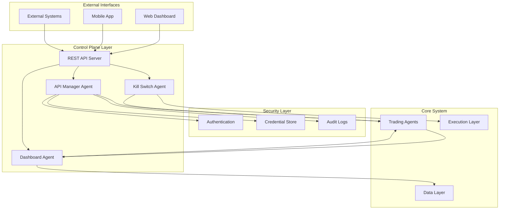

# Control Plane and Dashboard Integration Documentation

## Overview

The Control Plane and Dashboard Integration provides comprehensive system management, monitoring, and external control capabilities for the QuantAI AutoGen system. This layer ensures secure operations, emergency response, and real-time visibility into all system components.

## Architecture



## Component Specifications

### API Manager Agent (M1)

**Purpose**: Secure management of credentials, API keys, and external service access.

**Key Capabilities**:
- **Encrypted Credential Storage**: All sensitive data encrypted using Fernet encryption
- **Role-Based Access Control**: Granular permissions for credential access
- **Automatic Rotation**: Configurable credential rotation policies
- **Rate Limiting**: Per-service API call rate limiting and monitoring
- **Service Health Monitoring**: Continuous health checks of external services
- **Audit Logging**: Comprehensive security audit trails

**Supported Services**:
```python
supported_services = {
    "trading": {
        "alpaca": {"type": "broker", "auth_type": "api_key"},
        "interactive_brokers": {"type": "broker", "auth_type": "credentials"},
        "td_ameritrade": {"type": "broker", "auth_type": "oauth"}
    },
    "data": {
        "alpha_vantage": {"type": "data_provider", "auth_type": "api_key"},
        "polygon": {"type": "data_provider", "auth_type": "api_key"},
        "newsapi": {"type": "data_provider", "auth_type": "api_key"}
    },
    "ai": {
        "openai": {"type": "ai_model", "auth_type": "api_key"},
        "anthropic": {"type": "ai_model", "auth_type": "api_key"},
        "google": {"type": "ai_model", "auth_type": "api_key"}
    }
}
```

**Security Features**:
- AES-256 encryption for credential storage
- JWT-based authentication with configurable expiration
- API key generation and management
- Access logging and anomaly detection
- Automatic credential rotation scheduling

### Kill Switch Agent (M3)

**Purpose**: Emergency stop functionality and crisis management.

**Key Capabilities**:
- **Automatic Risk Triggers**: Portfolio loss, drawdown, and VaR thresholds
- **Manual Emergency Controls**: Immediate stop, liquidation, and shutdown
- **Graduated Response**: Configurable emergency procedures
- **System Isolation**: Complete system shutdown and isolation
- **Recovery Procedures**: Systematic recovery and reset processes
- **Incident Management**: Comprehensive incident logging and notification

**Emergency Triggers**:
```python
trigger_thresholds = {
    "portfolio_loss": 0.20,     # 20% portfolio loss
    "daily_loss": 0.05,         # 5% daily loss
    "drawdown": 0.25,           # 25% maximum drawdown
    "risk_breach": True,        # Risk control violations
    "manual_trigger": True,     # Manual activation
    "system_error": True        # Critical system errors
}
```

**Emergency Procedures**:
1. **Stop New Trades**: Halt all new trading activities
2. **Cancel Pending Orders**: Cancel all outstanding orders
3. **Liquidate Positions**: Force liquidation of all positions
4. **Disable Strategies**: Deactivate all trading strategies
5. **Notify Stakeholders**: Send emergency notifications
6. **Log Incident**: Record detailed incident information
7. **Isolate System**: Disconnect from external services

**Recovery Process**:
- Manual authorization required for emergency reset
- Systematic verification of system state
- Gradual re-enablement of system components
- Post-incident analysis and learning

### Dashboard Agent (V0)

**Purpose**: Real-time monitoring, visualization, and system control interface.

**Key Capabilities**:
- **Real-Time Monitoring**: Live system metrics and performance data
- **Interactive Dashboards**: Customizable monitoring interfaces
- **Alert Management**: Configurable alerts and notifications
- **Performance Analytics**: Historical analysis and reporting
- **System Health Monitoring**: Comprehensive health dashboards
- **Control Interfaces**: Manual intervention and control panels

**Dashboard Components**:

1. **System Overview**:
   - Overall system health and status
   - Active agents and their states
   - Resource utilization metrics
   - Error rates and performance

2. **Trading Dashboard**:
   - Live portfolio performance
   - Position monitoring and P&L
   - Trade execution status
   - Strategy performance comparison

3. **Risk Management**:
   - Real-time risk metrics
   - Risk limit monitoring
   - Exposure analysis
   - Stress testing results

4. **Strategy Monitoring**:
   - Individual strategy performance
   - Strategy allocation and weights
   - Signal strength and confidence
   - Lifecycle status

**Alert Categories**:
```python
alert_types = {
    "risk": {
        "var_threshold": 0.02,      # 2% VaR threshold
        "drawdown_threshold": 0.15,  # 15% drawdown threshold
        "leverage_threshold": 3.0    # 3x leverage threshold
    },
    "performance": {
        "strategy_underperform": 0.10,  # 10% underperformance
        "correlation_break": 0.30       # 30% correlation change
    },
    "system": {
        "agent_failure": True,
        "data_feed_loss": True,
        "execution_errors": True
    }
}
```

### REST API Control Plane

**Purpose**: External HTTP/REST interfaces for system integration and control.

**Key Features**:
- **Comprehensive API Coverage**: Full system control via REST endpoints
- **Authentication & Authorization**: JWT-based security with role permissions
- **Real-Time Updates**: WebSocket feeds for live data
- **Rate Limiting**: API usage monitoring and throttling
- **Documentation**: Auto-generated API documentation

**API Endpoints**:

#### Authentication
```
POST /auth/login          # User authentication
POST /auth/refresh        # Token refresh
POST /auth/logout         # User logout
```

#### System Management
```
GET  /health              # System health check
GET  /status              # Comprehensive system status
GET  /config              # System configuration
PUT  /config              # Update configuration
```

#### Strategy Management
```
GET  /strategies          # List all strategies
GET  /strategies/{id}     # Get strategy details
POST /strategies/{id}/start   # Start strategy
POST /strategies/{id}/stop    # Stop strategy
POST /strategies/{id}/pause   # Pause strategy
```

#### Risk Management
```
GET  /risk/status         # Current risk status
GET  /risk/alerts         # Risk alerts
PUT  /risk/limits         # Update risk limits
```

#### Emergency Controls
```
POST /emergency/stop      # Emergency stop
POST /emergency/liquidate # Force liquidation
POST /emergency/reset     # Reset emergency state
```

#### Performance & Analytics
```
GET  /performance/portfolio    # Portfolio performance
GET  /performance/strategies   # Strategy performance
GET  /analytics/reports        # Generate reports
```

## Security Architecture

### Authentication & Authorization

**JWT-Based Authentication**:
```python
# Token Structure
{
    "sub": "username",
    "user_id": "user_123",
    "role": "trader",
    "exp": 1640995200,
    "iat": 1640991600,
    "type": "access"
}
```

**Role-Based Permissions**:
```python
role_permissions = {
    "admin": [
        "read:all", "write:all", "delete:all",
        "emergency:stop", "emergency:liquidate",
        "config:read", "config:write"
    ],
    "trader": [
        "read:strategies", "write:strategies",
        "strategies:start", "strategies:stop",
        "read:performance", "read:risk"
    ],
    "viewer": [
        "read:strategies", "read:performance",
        "read:risk", "read:dashboard"
    ],
    "api": [
        "read:strategies", "read:performance",
        "strategies:start", "strategies:stop"
    ]
}
```

### Credential Management

**Encryption**:
- AES-256 encryption for all stored credentials
- Secure key derivation and rotation
- In-memory credential handling only

**Access Control**:
- Agent-based access permissions
- Request logging and audit trails
- Rate limiting per service and requester

**Rotation Policies**:
- Configurable rotation intervals (default: 90 days)
- Automatic rotation scheduling
- Manual rotation capabilities
- Expiration monitoring and alerts

## Configuration

### API Manager Configuration
```python
api_manager_config = {
    "encryption_key": "auto_generated",
    "credential_rotation_days": 90,
    "max_api_calls_per_minute": 100,
    "supported_services": {...},
    "audit_logging": True
}
```

### Kill Switch Configuration
```python
kill_switch_config = {
    "max_portfolio_loss": 0.20,
    "max_daily_loss": 0.05,
    "max_drawdown": 0.25,
    "emergency_contacts": ["risk@company.com"],
    "auto_triggers": True,
    "manual_override": True
}
```

### Dashboard Configuration
```python
dashboard_config = {
    "port": 8501,
    "update_interval_seconds": 5,
    "max_history_points": 1000,
    "theme": "dark",
    "auto_refresh": True,
    "alerts": {
        "enabled": True,
        "sound": False,
        "popup": True
    }
}
```

### API Server Configuration
```python
api_server_config = {
    "host": "0.0.0.0",
    "port": 8000,
    "enable_auth": True,
    "cors_origins": ["http://localhost:3000"],
    "rate_limiting": {
        "requests_per_minute": 60,
        "burst_size": 10
    }
}
```

## Usage Examples

### Basic Control Plane Setup
```python
from quantai.core.runtime import QuantRuntime
from quantai.agents.control import APIManagerAgent, KillSwitchAgent, DashboardAgent
from quantai.api.server import APIServer

# Initialize runtime
runtime = QuantRuntime(config)

# Register control agents
await runtime.register_agent_type(AgentRole.API_MANAGER, APIManagerAgent)
await runtime.register_agent_type(AgentRole.KILL_SWITCH, KillSwitchAgent)
await runtime.register_agent_type(AgentRole.DASHBOARD, DashboardAgent)

# Start runtime
await runtime.start()

# Create API server
api_server = APIServer(runtime=runtime, port=8000)
await api_server.start_server()
```

### Credential Management
```python
# Store broker credentials
store_creds = ControlMessage(
    command="store_credentials",
    parameters={
        "service": "alpaca",
        "credentials": {
            "api_key": "your_api_key",
            "secret_key": "your_secret_key"
        },
        "metadata": {"environment": "paper"}
    }
)

await runtime.send_message(store_creds)

# Retrieve credentials
get_creds = ControlMessage(
    command="get_credentials",
    parameters={
        "service": "alpaca",
        "requester_id": "execution_agent_001"
    }
)

response = await runtime.send_message(get_creds)
```

### Emergency Controls
```python
# Manual emergency stop
emergency_stop = ControlMessage(
    command="emergency_stop",
    parameters={"reason": "Market volatility spike"}
)

await runtime.send_message(emergency_stop)

# Force liquidation
liquidate = ControlMessage(
    command="force_liquidation",
    parameters={"reason": "Risk limit breach"}
)

await runtime.send_message(liquidate)
```

### Dashboard Monitoring
```python
# Get dashboard data
dashboard_data = ControlMessage(
    command="get_dashboard_data",
    parameters={}
)

response = await runtime.send_message(dashboard_data)
data = response.parameters["dashboard_data"]

# Add custom alert
alert = ControlMessage(
    command="add_alert",
    parameters={
        "alert": {
            "type": "custom",
            "severity": "warning",
            "title": "Custom Alert",
            "message": "Custom monitoring alert"
        }
    }
)

await runtime.send_message(alert)
```

### REST API Usage
```python
import aiohttp

# Authenticate
async with aiohttp.ClientSession() as session:
    login_data = {"username": "trader", "password": "password"}
    async with session.post("/auth/login", json=login_data) as response:
        auth_data = await response.json()
        token = auth_data["access_token"]
    
    # Use authenticated endpoints
    headers = {"Authorization": f"Bearer {token}"}
    
    # Get system status
    async with session.get("/status", headers=headers) as response:
        status = await response.json()
    
    # Start strategy
    async with session.post("/strategies/strategy_001/start", headers=headers) as response:
        result = await response.json()
```

## Monitoring and Alerting

### System Health Metrics
- **Agent Health**: Individual agent status and heartbeats
- **Resource Usage**: CPU, memory, disk, and network utilization
- **Performance Metrics**: Response times, throughput, error rates
- **External Services**: API health and connectivity status

### Alert Configuration
```python
alert_rules = {
    "system_health": {
        "cpu_usage": {"threshold": 80, "severity": "warning"},
        "memory_usage": {"threshold": 90, "severity": "critical"},
        "disk_usage": {"threshold": 85, "severity": "warning"}
    },
    "trading_performance": {
        "strategy_failure": {"threshold": 3, "severity": "critical"},
        "execution_latency": {"threshold": 1000, "severity": "warning"}
    },
    "risk_management": {
        "var_breach": {"threshold": 0.02, "severity": "critical"},
        "drawdown": {"threshold": 0.15, "severity": "warning"}
    }
}
```

### Notification Channels
- **Email**: Critical alerts and daily reports
- **Slack/Teams**: Real-time notifications
- **SMS**: Emergency alerts only
- **Dashboard**: All alerts with visual indicators
- **API Webhooks**: External system integration

## Deployment and Operations

### Production Deployment
```yaml
# docker-compose.yml
version: '3.8'
services:
  quantai-control:
    image: quantai:latest
    ports:
      - "8000:8000"
      - "8501:8501"
    environment:
      - QUANTAI_ENV=production
      - API_SECRET_KEY=${API_SECRET_KEY}
      - DB_CONNECTION_STRING=${DB_CONNECTION_STRING}
    volumes:
      - ./config:/app/config
      - ./logs:/app/logs
```

### High Availability Setup
- **Load Balancing**: Multiple API server instances
- **Database Clustering**: Redundant data storage
- **Failover Mechanisms**: Automatic failover for critical components
- **Backup Procedures**: Regular system and data backups

### Security Hardening
- **Network Security**: VPN, firewalls, and network segmentation
- **Access Controls**: Multi-factor authentication and IP whitelisting
- **Encryption**: TLS/SSL for all communications
- **Audit Logging**: Comprehensive security event logging
- **Regular Updates**: Security patches and dependency updates

## Troubleshooting

### Common Issues

1. **Authentication Failures**
   - Check JWT token expiration
   - Verify user credentials and permissions
   - Review API key configuration

2. **Emergency System Not Responding**
   - Check kill switch agent status
   - Verify emergency trigger thresholds
   - Review system resource availability

3. **Dashboard Data Missing**
   - Verify agent message routing
   - Check data update intervals
   - Review dashboard configuration

4. **API Rate Limiting**
   - Check rate limit configuration
   - Monitor API usage patterns
   - Adjust limits as needed

### Diagnostic Commands
```bash
# Check system health
curl http://localhost:8000/health

# View agent status
curl -H "Authorization: Bearer $TOKEN" http://localhost:8000/agents

# Check emergency status
curl -H "Authorization: Bearer $TOKEN" http://localhost:8000/emergency/status

# View system logs
docker logs quantai-control
```

## Best Practices

### Security
- **Principle of Least Privilege**: Grant minimum necessary permissions
- **Regular Rotation**: Implement automatic credential rotation
- **Audit Everything**: Maintain comprehensive audit logs
- **Secure Communications**: Use TLS for all external communications

### Operations
- **Monitoring**: Implement comprehensive monitoring and alerting
- **Testing**: Regular testing of emergency procedures
- **Documentation**: Maintain up-to-date operational procedures
- **Training**: Ensure team familiarity with emergency procedures

### Performance
- **Resource Monitoring**: Track system resource usage
- **Optimization**: Regular performance tuning and optimization
- **Scaling**: Plan for horizontal scaling as needed
- **Caching**: Implement appropriate caching strategies

This control plane and dashboard integration provides a robust, secure, and comprehensive management layer for the QuantAI AutoGen system, ensuring reliable operations and effective crisis management.
