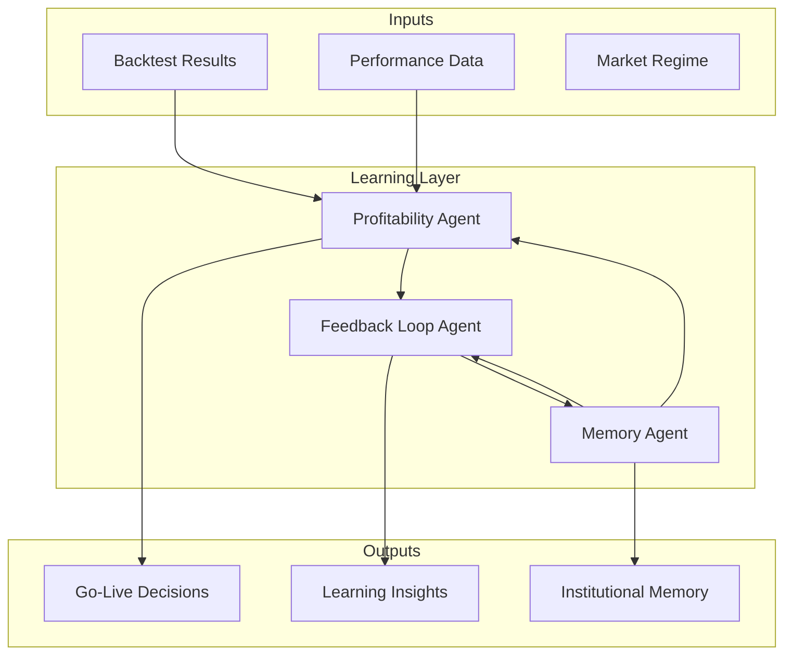

# Learning Agents Documentation

## Overview

The Learning Agents form the intelligence core of the QuantAI AutoGen system, responsible for making critical decisions, learning from outcomes, and maintaining institutional knowledge. These agents enable the system to continuously improve and adapt to changing market conditions.

## Architecture



## Agent Specifications

### Profitability Agent (A6)

**Purpose**: Makes intelligent go-live decisions and monitors live strategy performance.

**Key Capabilities**:
- Performance evaluation against rigorous criteria
- Risk-adjusted decision making with confidence scoring
- Live performance monitoring and alerting
- Strategy lifecycle management (start/pause/stop)
- Dynamic threshold adjustment based on market conditions

**Decision Framework**:
```python
# Performance Criteria (Regime-Adjusted)
min_sharpe_ratio = 1.0 * regime_multiplier
min_annual_return = 0.08 * regime_multiplier  
max_drawdown = 0.15
min_confidence = 0.8
min_sample_size = 30 trades

# Decision Logic
if overall_score >= 0.8:
    decision = "APPROVED"
elif overall_score >= 0.6:
    decision = "CONDITIONAL_APPROVAL"
else:
    decision = "REJECTED"
```

**Market Regime Adjustments**:
- **Bull Market**: Lower Sharpe requirement (0.9x), higher return expectation (1.1x)
- **Bear Market**: Higher Sharpe requirement (1.2x), lower return expectation (0.8x)
- **High Volatility**: Higher Sharpe requirement (1.3x), standard return expectation
- **Sideways Market**: Moderate adjustments for both metrics

**Live Monitoring**:
- Real-time performance tracking vs expectations
- Automated alerts for performance degradation
- Drawdown monitoring with circuit breakers
- Sharpe ratio degradation detection

### Feedback Loop Agent (A5)

**Purpose**: Learns from strategy outcomes to continuously improve the development process.

**Key Capabilities**:
- Root cause analysis of failures and successes
- Pattern recognition across strategy types and market conditions
- Learning extraction and insight generation
- Process improvement recommendations
- Systematic bias identification

**Learning Categories**:

1. **Market Regime Patterns**:
   ```python
   regime_patterns = {
       "bull_market": {
           "momentum_success_rate": 0.75,
           "mean_reversion_success_rate": 0.35
       },
       "bear_market": {
           "momentum_success_rate": 0.45, 
           "mean_reversion_success_rate": 0.65
       }
   }
   ```

2. **Strategy Type Insights**:
   - Momentum strategies: Best in trending markets
   - Mean reversion: Best in range-bound markets
   - Arbitrage: Consistent across regimes
   - Factor strategies: Regime-dependent performance

3. **Risk Management Learnings**:
   - Stop loss implementation effectiveness
   - Position sizing impact on performance
   - Correlation monitoring importance
   - Drawdown recovery patterns

**Pattern Analysis**:
- Minimum 5 strategies required for pattern recognition
- Statistical significance testing for insights
- Confidence scoring based on sample size
- Cross-validation of patterns across time periods

### Memory Agent (D6)

**Purpose**: Maintains long-term institutional knowledge and provides historical context.

**Key Capabilities**:
- Strategy outcome storage and retrieval
- Market regime and event memory
- Cross-strategy learning preservation
- Knowledge graph construction
- Contextual information retrieval

**Memory Categories**:

1. **Strategy Memory**:
   ```python
   strategy_memory = {
       "strategy_id": "momentum_001",
       "performance_metrics": {...},
       "market_conditions": {...},
       "code": "...",
       "lessons_learned": [...]
   }
   ```

2. **Market Memory**:
   ```python
   market_memory = {
       "regime": "bull_market_2024",
       "characteristics": {...},
       "key_events": [...],
       "strategy_performance": {...}
   }
   ```

3. **Learning Memory**:
   ```python
   learning_memory = {
       "insights": [...],
       "patterns": {...},
       "recommendations": [...],
       "confidence": 0.85
   }
   ```

**Knowledge Graph**:
- Entity relationships between strategies, markets, and outcomes
- Temporal connections across market cycles
- Causal relationships between factors and performance
- Similarity clustering for pattern recognition

## Integration Workflow

### 1. Strategy Evaluation Flow
```
Backtest Results → Profitability Agent → Go-Live Decision
                ↓
            Performance Tracking → Feedback Loop Agent
                ↓
            Learning Insights → Memory Agent → Knowledge Storage
```

### 2. Continuous Learning Cycle
```
Historical Data → Pattern Recognition → Insight Generation
       ↓                ↓                    ↓
   Memory Storage → Recommendation → Process Improvement
       ↓                ↓                    ↓
   Context Retrieval → Decision Support → Better Outcomes
```

### 3. Adaptive Decision Making
```
Current Market → Memory Retrieval → Historical Context
      ↓               ↓                    ↓
  Strategy Eval → Pattern Matching → Adjusted Criteria
      ↓               ↓                    ↓
  Go-Live Decision → Outcome Tracking → Learning Update
```

## Usage Examples

### Basic Profitability Evaluation
```python
from quantai.agents.learning import ProfitabilityAgent
from quantai.core.messages import BacktestMessage

# Initialize agent
profitability_agent = ProfitabilityAgent(
    model_client=model_client,
    min_sharpe_ratio=1.0,
    min_annual_return=0.08,
    max_drawdown=0.15
)

# Create backtest results
backtest_results = BacktestMessage(
    strategy_id="momentum_001",
    performance_metrics={
        "annual_return": 0.15,
        "sharpe_ratio": 1.5,
        "max_drawdown": 0.08,
        "win_rate": 0.62
    }
)

# Evaluate strategy
decision = await profitability_agent.process_message(backtest_results, None)
print(f"Decision: {decision.parameters['decision']}")
```

### Learning from Feedback
```python
from quantai.agents.learning import FeedbackLoopAgent
from quantai.core.messages import FeedbackMessage

# Initialize agent
feedback_agent = FeedbackLoopAgent(
    model_client=model_client,
    learning_window_days=90
)

# Provide strategy feedback
feedback = FeedbackMessage(
    strategy_id="momentum_001",
    performance_actual={"sharpe_ratio": 1.4},
    performance_expected={"sharpe_ratio": 1.5},
    success_factors=["Strong trend detection"],
    failure_factors=[],
    lessons_learned=["Works well in trending markets"]
)

# Process feedback
insights = await feedback_agent.process_message(feedback, None)
```

### Memory Storage and Retrieval
```python
from quantai.agents.learning import MemoryAgent
from quantai.core.messages import MemoryMessage

# Initialize agent
memory_agent = MemoryAgent(
    model_client=model_client,
    memory_retention_days=365
)

# Store strategy memory
store_msg = MemoryMessage(
    memory_type="strategy",
    operation="store",
    key="momentum_001",
    value={
        "strategy_id": "momentum_001",
        "performance_metrics": {...},
        "market_conditions": {...}
    }
)

await memory_agent.process_message(store_msg, None)

# Retrieve similar strategies
retrieve_msg = MemoryMessage(
    memory_type="strategy", 
    operation="retrieve",
    query="momentum strategies trending markets"
)

results = await memory_agent.process_message(retrieve_msg, None)
```

## Configuration

### Profitability Agent Configuration
```python
profitability_config = {
    "min_sharpe_ratio": 1.0,
    "min_annual_return": 0.08,
    "max_drawdown": 0.15,
    "min_backtest_period_days": 252,
    "confidence_threshold": 0.8,
    "market_regime_adjustments": {
        "bull_market": {"sharpe_multiplier": 0.9},
        "bear_market": {"sharpe_multiplier": 1.2}
    }
}
```

### Feedback Loop Agent Configuration
```python
feedback_config = {
    "learning_window_days": 90,
    "min_strategies_for_learning": 5,
    "pattern_confidence_threshold": 0.7,
    "pattern_categories": [
        "market_regime", "strategy_type", 
        "timeframe", "asset_class"
    ]
}
```

### Memory Agent Configuration
```python
memory_config = {
    "memory_retention_days": 1095,  # 3 years
    "similarity_threshold": 0.7,
    "max_memory_items": 10000,
    "vector_db_config": {
        "provider": "chroma",
        "collection_name": "quantai_memory"
    }
}
```

## Performance Metrics

### Profitability Agent Metrics
- **Decision Accuracy**: Percentage of correct go-live decisions
- **False Positive Rate**: Approved strategies that failed
- **False Negative Rate**: Rejected strategies that would have succeeded
- **Average Decision Confidence**: Mean confidence score of decisions
- **Time to Decision**: Average time for evaluation completion

### Feedback Loop Agent Metrics
- **Learning Velocity**: Rate of insight generation over time
- **Pattern Recognition Accuracy**: Validation of identified patterns
- **Recommendation Effectiveness**: Success rate of implemented suggestions
- **Knowledge Transfer Rate**: Application of learnings to new strategies

### Memory Agent Metrics
- **Storage Efficiency**: Memory utilization vs retention value
- **Retrieval Accuracy**: Relevance of retrieved memories
- **Knowledge Graph Density**: Relationship richness in stored data
- **Context Relevance**: Quality of contextual information provided

## Best Practices

### 1. Decision Making
- Always require statistical significance before go-live approval
- Adjust criteria based on current market regime
- Maintain detailed audit trails for all decisions
- Implement graduated responses to performance issues

### 2. Learning Optimization
- Ensure sufficient sample sizes for pattern recognition
- Validate learnings across different time periods
- Balance historical insights with forward-looking adaptation
- Focus on actionable recommendations

### 3. Memory Management
- Prioritize high-value memories for long-term retention
- Maintain rich contextual relationships
- Implement efficient retrieval mechanisms
- Regular cleanup of outdated or low-value memories

### 4. Integration
- Ensure seamless data flow between learning agents
- Maintain consistency in evaluation criteria
- Implement feedback loops for continuous improvement
- Monitor system-wide learning effectiveness

## Troubleshooting

### Common Issues

1. **Low Decision Confidence**
   - Increase minimum sample size requirements
   - Improve backtest quality and duration
   - Add more evaluation criteria

2. **Poor Learning Convergence**
   - Ensure sufficient strategy diversity
   - Validate data quality and completeness
   - Adjust pattern recognition thresholds

3. **Memory Retrieval Issues**
   - Optimize vector embeddings and similarity thresholds
   - Improve query formulation and context
   - Regular memory system maintenance

4. **Integration Problems**
   - Verify message routing and processing
   - Check agent initialization and configuration
   - Monitor inter-agent communication patterns

## Future Enhancements

### Planned Features
- **Advanced Pattern Recognition**: Machine learning-based pattern detection
- **Multi-Objective Optimization**: Balancing multiple performance criteria
- **Regime Prediction**: Proactive adaptation to regime changes
- **Collaborative Learning**: Cross-system knowledge sharing
- **Explainable AI**: Enhanced decision transparency and reasoning
