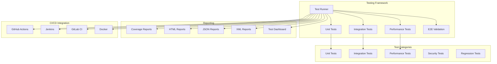

# Testing and Integration Framework Documentation

## Overview

The QuantAI AutoGen testing framework provides comprehensive validation capabilities ensuring system reliability, performance, and correctness across all components. The framework supports unit testing, integration testing, performance benchmarking, and end-to-end validation.

## Architecture



## Test Categories

### Unit Tests

**Purpose**: Test individual components in isolation to ensure correctness of core functionality.

**Coverage Areas**:
- Message system validation
- Agent initialization and lifecycle
- Risk calculation algorithms
- Strategy validation logic
- Data processing functions
- Utility functions and helpers

**Test Structure**:
```python
class TestMessageSystem:
    """Unit tests for the message system."""
    
    def test_message_creation(self):
        """Test message object creation."""
        message = MarketDataMessage(
            symbol="AAPL",
            price=150.0,
            volume=1000000
        )
        assert message.symbol == "AAPL"
        assert message.price == 150.0
    
    def test_message_validation(self):
        """Test message validation logic."""
        with pytest.raises(ValidationError):
            MarketDataMessage(
                symbol="",  # Invalid empty symbol
                price=-10.0  # Invalid negative price
            )
```

**Execution**:
```bash
# Run all unit tests
pytest tests/unit/ -m unit

# Run with coverage
pytest tests/unit/ --cov=quantai --cov-report=html

# Run specific component tests
pytest tests/unit/test_messages.py -v
```

### Integration Tests

**Purpose**: Test interactions between multiple components to validate system integration.

**Test Scenarios**:

1. **Complete Workflow Integration**:
   - Data ingestion → Analysis → Strategy → Execution
   - Validates end-to-end data flow
   - Tests agent coordination

2. **Agent Communication**:
   - Message routing and delivery
   - Subscription management
   - Error handling and recovery

3. **Risk Management Integration**:
   - Real-time risk monitoring
   - Emergency response coordination
   - Limit enforcement

4. **Emergency Scenarios**:
   - Market crash response
   - System failure recovery
   - Security incident handling

**Example Integration Test**:
```python
@pytest.mark.integration
async def test_complete_trading_workflow(full_system_runtime):
    """Test complete trading workflow integration."""
    
    # Step 1: Market data ingestion
    market_data = MarketDataMessage(...)
    await runtime.send_message(market_data)
    
    # Step 2: Strategy signal generation
    strategy_signal = TradeMessage(...)
    await runtime.send_message(strategy_signal)
    
    # Step 3: Risk assessment
    risk_check = RiskMessage(...)
    await runtime.send_message(risk_check)
    
    # Step 4: Trade execution
    execution_order = TradeMessage(...)
    await runtime.send_message(execution_order)
    
    # Validate workflow completion
    status = await runtime.get_system_status()
    assert status["runtime_status"] == "running"
```

### Performance Tests

**Purpose**: Validate system performance under various load conditions and ensure SLA compliance.

**Benchmark Categories**:

1. **Throughput Benchmarks**:
   - Message processing rate
   - Data ingestion throughput
   - Trade execution speed

2. **Latency Benchmarks**:
   - End-to-end latency
   - Agent response times
   - Risk calculation speed

3. **Resource Usage**:
   - Memory consumption
   - CPU utilization
   - Network bandwidth

4. **Scalability Tests**:
   - Concurrent user handling
   - Multi-strategy coordination
   - System load limits

**Performance Test Example**:
```python
@pytest.mark.performance
async def test_message_throughput():
    """Test message processing throughput."""
    
    start_time = time.time()
    message_count = 10000
    
    # Send messages at high frequency
    for i in range(message_count):
        message = MarketDataMessage(
            symbol=f"TEST_{i}",
            price=100.0 + i * 0.01,
            volume=1000
        )
        await runtime.send_message(message)
    
    duration = time.time() - start_time
    throughput = message_count / duration
    
    # Assert minimum throughput requirement
    assert throughput >= 1000  # 1000 messages/second
```

### End-to-End Validation

**Purpose**: Validate complete system functionality in realistic scenarios.

**Validation Scenarios**:

1. **Production Simulation**:
   - Live market data processing
   - Real-time strategy execution
   - Multi-asset portfolio management

2. **Crisis Management**:
   - Market crash scenarios
   - System failure recovery
   - Emergency liquidation

3. **Regulatory Compliance**:
   - Risk limit enforcement
   - Audit trail validation
   - Reporting accuracy

## Test Execution

### Local Testing

```bash
# Run all tests
python tests/test_runner.py

# Run specific test categories
pytest -m unit
pytest -m integration
pytest -m performance

# Run with coverage
pytest --cov=quantai --cov-report=html

# Run in parallel
pytest -n auto

# Run with detailed output
pytest -v -s
```

### Automated Testing

**GitHub Actions Workflow**:
```yaml
name: QuantAI Test Suite

on: [push, pull_request]

jobs:
  test:
    runs-on: ubuntu-latest
    
    steps:
    - uses: actions/checkout@v3
    
    - name: Set up Python
      uses: actions/setup-python@v4
      with:
        python-version: '3.9'
    
    - name: Install dependencies
      run: |
        pip install -r requirements.txt
        pip install -r requirements-test.txt
    
    - name: Run unit tests
      run: pytest tests/unit/ --cov=quantai
    
    - name: Run integration tests
      run: pytest tests/integration/
    
    - name: Upload coverage
      uses: codecov/codecov-action@v3
```

## Test Configuration

### Pytest Configuration (`pytest.ini`):
```ini
[tool:pytest]
testpaths = tests
addopts = 
    --verbose
    --cov=quantai
    --cov-report=html
    --cov-fail-under=75
    --junit-xml=test_results/junit.xml

markers =
    unit: Unit tests
    integration: Integration tests
    performance: Performance tests
    slow: Slow running tests
    critical: Critical path tests
```

### Coverage Configuration (`.coveragerc`):
```ini
[run]
source = quantai
omit = 
    */tests/*
    */venv/*
    */__pycache__/*

[report]
exclude_lines =
    pragma: no cover
    def __repr__
    raise AssertionError
    raise NotImplementedError
```

## Test Data Management

### Mock Data Generation

```python
class TestDataFactory:
    """Factory for generating test data."""
    
    @staticmethod
    def create_market_data(symbol: str = "AAPL") -> MarketDataMessage:
        """Create mock market data."""
        return MarketDataMessage(
            symbol=symbol,
            price=150.0 + random.uniform(-10, 10),
            volume=random.randint(100000, 1000000),
            timestamp=datetime.now()
        )
    
    @staticmethod
    def create_portfolio(size: int = 10) -> Dict[str, Any]:
        """Create mock portfolio."""
        symbols = [f"STOCK_{i}" for i in range(size)]
        return {
            symbol: {
                "quantity": random.randint(100, 1000),
                "price": 100.0 + random.uniform(-20, 20)
            }
            for symbol in symbols
        }
```

### Test Fixtures

```python
@pytest.fixture
async def runtime():
    """Create test runtime."""
    config = QuantConfig()
    runtime = QuantRuntime(config)
    await runtime.start()
    yield runtime
    await runtime.stop()

@pytest.fixture
def mock_market_data():
    """Provide mock market data."""
    return TestDataFactory.create_market_data()

@pytest.fixture
def sample_portfolio():
    """Provide sample portfolio."""
    return TestDataFactory.create_portfolio(5)
```

## Reporting and Analytics

### Test Reports

1. **HTML Report**: Interactive test results with drill-down capabilities
2. **JUnit XML**: Standard format for CI/CD integration
3. **JSON Report**: Machine-readable results for automation
4. **Coverage Report**: Code coverage analysis with line-by-line details

### Performance Dashboards

```python
class PerformanceDashboard:
    """Performance monitoring dashboard."""
    
    def generate_report(self, results: Dict[str, Any]) -> str:
        """Generate performance report."""
        return f"""
        Performance Test Results
        ========================
        
        Throughput Tests:
        - Message Processing: {results['throughput']['messages_per_sec']} msg/s
        - Data Ingestion: {results['throughput']['data_points_per_sec']} pts/s
        
        Latency Tests:
        - End-to-End: {results['latency']['e2e_ms']} ms
        - Risk Calculation: {results['latency']['risk_calc_ms']} ms
        
        Resource Usage:
        - Peak Memory: {results['resources']['peak_memory_mb']} MB
        - CPU Utilization: {results['resources']['cpu_percent']}%
        """
```

## Quality Gates

### Coverage Requirements

- **Minimum Coverage**: 75% overall
- **Critical Components**: 90% coverage
- **New Code**: 80% coverage
- **Integration Paths**: 100% coverage

### Performance Thresholds

- **Message Throughput**: ≥ 1,000 messages/second
- **End-to-End Latency**: ≤ 100ms (95th percentile)
- **Agent Startup Time**: ≤ 500ms
- **Memory Usage**: ≤ 1GB under normal load

### Quality Metrics

```python
QUALITY_GATES = {
    "coverage": {
        "minimum": 0.75,
        "critical_components": 0.90,
        "new_code": 0.80
    },
    "performance": {
        "message_throughput": 1000,  # msg/s
        "e2e_latency_p95": 100,      # ms
        "startup_time": 500,         # ms
        "memory_limit": 1024         # MB
    },
    "reliability": {
        "test_pass_rate": 0.95,
        "integration_success": 0.98,
        "error_rate": 0.01
    }
}
```

## Continuous Integration

### Pipeline Stages

1. **Code Quality**: Linting, formatting, type checking
2. **Unit Tests**: Fast, isolated component tests
3. **Integration Tests**: Multi-component interaction tests
4. **Performance Tests**: Benchmark validation
5. **Security Scans**: Vulnerability assessment
6. **Build & Package**: Container and artifact creation
7. **Deployment**: Staging environment deployment
8. **E2E Validation**: Production-like testing

### Failure Handling

```python
class TestFailureHandler:
    """Handle test failures and recovery."""
    
    def handle_failure(self, test_result: TestResult):
        """Handle test failure."""
        if test_result.category == "critical":
            self.block_deployment()
            self.notify_team(urgency="high")
        elif test_result.category == "performance":
            self.create_performance_ticket()
        else:
            self.log_failure(test_result)
    
    def retry_strategy(self, test: Test) -> bool:
        """Determine if test should be retried."""
        return (
            test.is_flaky and 
            test.retry_count < 3 and
            test.category != "critical"
        )
```

## Best Practices

### Test Design

1. **Isolation**: Tests should be independent and not affect each other
2. **Determinism**: Tests should produce consistent results
3. **Speed**: Unit tests should be fast (< 1 second each)
4. **Clarity**: Test names and structure should be self-documenting
5. **Coverage**: Aim for high coverage of critical paths

### Test Maintenance

1. **Regular Updates**: Keep tests current with code changes
2. **Flaky Test Management**: Identify and fix unreliable tests
3. **Performance Monitoring**: Track test execution times
4. **Data Management**: Keep test data fresh and relevant
5. **Documentation**: Maintain clear test documentation

### Debugging

```python
# Enable detailed logging for debugging
import logging
logging.basicConfig(level=logging.DEBUG)

# Use pytest debugging features
pytest.main(["-v", "-s", "--pdb", "tests/test_specific.py"])

# Capture and analyze test artifacts
@pytest.fixture(autouse=True)
def capture_logs(caplog):
    """Capture logs for debugging."""
    yield
    if caplog.records:
        print("Captured logs:")
        for record in caplog.records:
            print(f"  {record.levelname}: {record.message}")
```

This comprehensive testing framework ensures the QuantAI AutoGen system maintains high quality, reliability, and performance standards throughout its development and deployment lifecycle.
